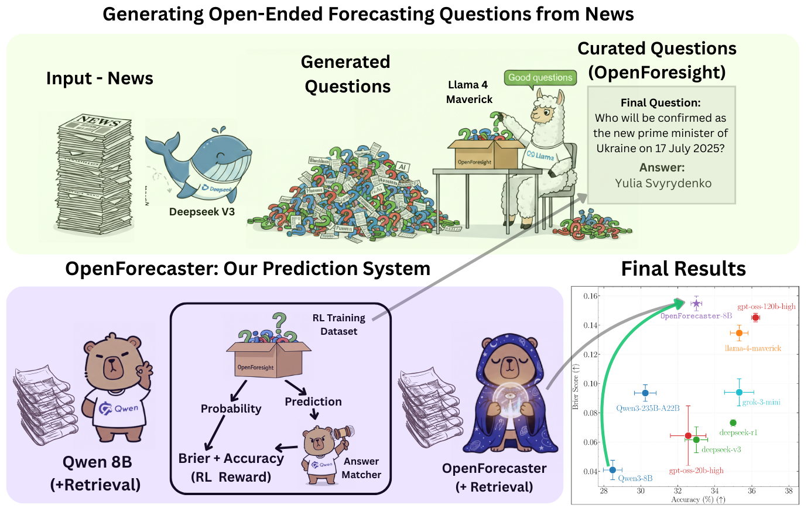

# Forecasting-RL: Scaling Open-Ended Reasoning to Predict the Future 



Codebase for generating open-ended forecasting questions from news articles (used to develop [OpenForesight](https://huggingface.co/datasets/nikhilchandak/OpenForesight)), scraping data from prediction markets, and RL training of language models on forecasting questions to develop models like [OpenForecaster-8B](https://huggingface.co/nikhilchandak/OpenForecaster-8B). 

**Paper**: [Scaling Open-Ended Reasoning To Predict the Future](https://arxiv.org/abs/2512.25070)  
**Website**: [openforecaster.github.io](https://openforecaster.github.io) 

## Installation

Requirements: `uv` (pre-installed).

```bash
# Clone repository
git clone [REPOSITORY_URL]

# Automated setup (recommended)
./setup.sh

# Manual setup alternative
uv venv forecast && source forecast/bin/activate
uv pip install torch torchvision --index-url https://download.pytorch.org/whl/cu121
uv pip install -e .
```

## Core Workflows

### 1. Question Generation (`qgen/`)

End-to-end pipeline for generating forecasting questions from news articles with quality filtering and leakage detection.

**Complete Pipeline**:
```bash
python qgen/run_pipeline.py \
    --article_path qgen/sample_data/telegraph20.jsonl \
    --output_dir ./output \
    --use_openrouter \
    --openrouter_model deepseek/deepseek-v3.2 \
    --num_q 3 \
    --cutoff_date 2025-05-01
```

**What it does**: Generates free-form questions, extracts resolution dates, filters by date and answer type, removes temporal leakage.

**Output Format**:
```json
{
  "question_id": 482761,
  "question_title": "Who will win the Nobel Prize in ... in 2025?",
  "background": "Context...",
  "resolution_criteria": "Source: Nobel Committee...",
  "answer": "John Doe",
  "answer_type": "Name",
  "resolution_date": "2025-10-10"
}
```

### 2. RL Training (`libraries/verl/`)

Train language models using RL with VeRL on [OpenForesight](https://huggingface.co/datasets/nikhilchandak/OpenForesight) or custom datasets.

**Prepare OpenForesight Data**:
```bash
cd libraries/verl/examples/data_preprocess/forecasting

# Load full dataset
python load_foresight.py --split train --output_dir data/

# Or subsample
python load_foresight.py --split train --subsample 1000 --output_dir data/
```

**Prepare Custom Dataset**:
```bash
python prepare_custom_dataset.py \
    --questions_file /path/to/questions.jsonl \
    --output_dir data/ \
    --subsample 500
```

**Launch Training**:
```bash
cd libraries/verl
bash scripts/ours/trygpt/launch_script.sh
```

**Note**: VERL may have dependency conflicts so it might be required to create a separate environment for training.

### 3. Model Evaluation (`custom_eval_scripts/`)

Evaluate models locally using VLLM on various forecasting benchmarks.

**Freeform Questions**:
```bash
python custom_eval_scripts/eval_freeform.py \
    --model_dir /path/to/model \
    --questions_file questions.jsonl \
    --base_save_dir ./results \
    --num_generations 3
```

**Binary Questions**:
```bash
python custom_eval_scripts/eval_binary.py \
    --model_dir /path/to/model \
    --questions_file questions.jsonl \
    --base_save_dir ./results \
    --num_generations 5
```

**With Retrieval**:
```bash
python custom_eval_scripts/eval_retrieval.py \
    --model_dir /path/to/model \
    --questions_file questions_with_docs.jsonl \
    --base_save_dir ./results
```

**Supported Benchmarks**: Metaculus, Manifold, FutureBench, FutureX, MMLU-Pro, MATH, SimpleQA

### 4. Evaluation using LLM-as-a-Judge (`local_judge/`)

Use LLM judge to evaluate if free-form model responses match ground truth answers.

**Basic Usage**:
```bash
python local_judge/llm_judge.py \
    --model_dir /path/to/judge/model \
    --input_file responses.jsonl \
    --output_dir ./results
```

**Expected Input Format**:
```json
{
  "question": "Question text",
  "answer": "Ground truth answer",
  "extracted_answer": ["Response 1", "Response 2"]
}
```

**Output**: Adds binary scores and probabilities for each response to the input file.

## Additional Components

### Data Collection (`data/`)

Scrapers for prediction markets and news sources.

- **Metaculus**: `metaculus/metaculus_new.py` - Fetch questions from API
- **Manifold Markets**: `manifold_new.py` - Process data dumps
- **FutureX**: `futureX.py` - Download FutureX benchmark questions from HuggingFace
- **The Guardian**: `theguardian/guardian_fetcher_3months.py` - Fetch news articles in last 3 months.

### News Collection (`news/`)

Extract and process news articles from Common Crawl (27M+ articles, 150+ domains, 150GB+).

```bash
# Launch WARC extraction
python jobs_news.py --num_extractors 1 --domains domains.txt

# Convert to JSONL
python to_jsonl.py --input_dir extracted_articles/ --output_dir jsonl/

# Tokenize for BM25
python src/tokenize_for_rag.py --input_dir jsonl/ --output_dir tokenized/

# BM25 retrieval
python src/bm25_jsonl.py --articles_path articles.jsonl --questions_path questions.jsonl
```

### Embedding & Retrieval (`embeddding_retrieval/`)

KNN/BM25 retrieval pipeline for RAG-augmented forecasting.

```bash
# Basic usage
python embeddding_retrieval/main_new.py --data-dir /path/to/data

# Custom configuration
python embeddding_retrieval/main_new.py \
    --data-dir /path/to/data \
    --datasets metaculus manifold
```

**Features**: Document chunking, embedding caching, time-based filtering, KNN search with deduplication.

### API Evaluation (`openrouter_evals/`)

Evaluate commercial models (GPT-4, Claude, Gemini) via OpenRouter API.

- `freeform_evals.py` - Free-form evaluation
- `binary_evals.py` - Binary question evaluation
- `retrieval_evals.py` - RAG-augmented evaluation
