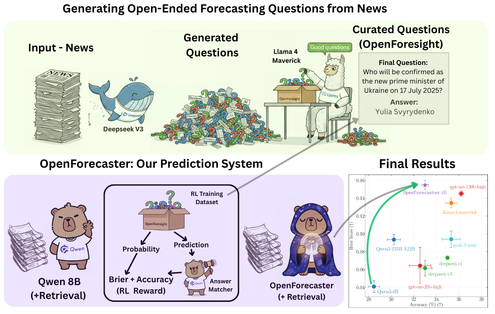

# Forecasting-RL: Scaling Open-Ended Reasoning to Predict the Future 



Codebase for generating open-ended forecasting questions from news articles (used to develop [OpenForesight](https://huggingface.co/datasets/nikhilchandak/OpenForesight)), scraping data from prediction markets, and RL training of language models on forecasting questions to develop models like [OpenForecaster-8B](https://huggingface.co/nikhilchandak/OpenForecaster-8B). 

📄 **Paper**: [Scaling Open-Ended Reasoning To Predict the Future](https://arxiv.org/abs/2512.25070)  
🌐 **Website**: [openforecaster.github.io](https://openforecaster.github.io) 

## 🏗️ Directory Overview

```
├── 📰 news/                  # News collection from Common Crawl
├── 🔍 qgen/                  # Question generation from news articles  
├── 📊 data/                  # Prediction market scrapers (Metaculus, Manifold, etc.)
├── 🔗 embeddding_retrieval/  # Document embedding and BM25/KNN retrieval
├── 🤖 libraries/verl/        # RL training (GRPO, PPO, etc.)
├── 📈 custom_eval_scripts/   # VLLM-based local model evaluation
├── 🌐 openrouter_evals/      # API-based model evaluation (GPT, Claude, etc.)
├── ⚖️ local_judge/           # LLM judge for free-form answer matching
├── 📊 plotting/              # Visualization and analysis
```

## 🚀 Quick Start

### Installation
```bash
# Clone repository
git clone [REPOSITORY_URL]
cd forecasting-rl

# Automated setup (recommended)
./setup.sh

# Manual setup alternative
uv venv forecast && source forecast/bin/activate
uv pip install torch torchvision --index-url https://download.pytorch.org/whl/cu121
uv pip install -e .
```

### Basic Usage
```bash
# Activate environment
source forecast/bin/activate

# Generate questions from news articles
python qgen/question_generator.py --articles_path data/articles.jsonl

# Evaluate model performance
python local_judge/llm_judge.py --model_path /path/to/model
```

## 📰 News Collection (`news/`)

Extracts news articles from Common Crawl archives using filtered domains.

**Key Files**:
- `jobs_news.py` - Launches cluster jobs for WARC extraction from Common Crawl
- `to_jsonl.py` - Converts extracted articles to JSONL format
- `domains.txt` - ~150 curated high-quality news domains
- `src/bm25_jsonl.py` - BM25 retrieval over tokenized news articles
- `src/tokenize_for_rag.py` - Tokenizes articles for retrieval

**Quick Start**:
```bash
python jobs_news.py --num_extractors 1 --domains domains.txt
python to_jsonl.py --input_dir extracted_articles/ --output_dir jsonl/
python src/bm25_jsonl.py --articles_path articles.jsonl --questions_path questions.jsonl
```

**Data**: 27M+ articles, 150+ domains, 150GB+

## 🔍 Question Generation (`qgen/`)

Generates forecasting questions from news articles using LLMs with quality filtering and leakage detection.

**Key Files**:
- `question_generator.py` - Main pipeline for generating questions from articles using OpenRouter API
- `filter_articles.py` - VLLM-based filtering of articles for forecasting relevance
- `remove_leakage.py` - Detects and removes questions with temporal data leakage
- `extract_date.py` - Extracts and validates resolution dates from questions
- `inference/` - Inference backends (VLLM, OpenRouter) for generation

**Usage**:
```bash
# Filter relevant articles
python qgen/filter_articles.py --articles_path raw_articles.jsonl --output_path filtered.jsonl

# Generate questions (using OpenRouter API)
python qgen/question_generator.py --articles_path filtered.jsonl --output_path questions.jsonl

# Remove leakage and validate dates
python qgen/remove_leakage.py --questions_path questions.jsonl --output_path clean.jsonl
python qgen/extract_date.py --input_path clean.jsonl --output_path dated.jsonl
```

## 📊 Data Collection (`data/`)

Scrapers for prediction markets and news sources.

**Key Files**:
- `metaculus/fetch_questions.py` - Scrapes questions from Metaculus API
- `manifold_new.py` - Processes Manifold Markets data dumps
- `futureX.py` - Handles FutureX benchmark dataset
- `theguardian/guardian_fetcher_3months.py` - Fetches articles from The Guardian API
- `foresight/push_to_hf.py` - Pushes OpenForesight dataset to Hugging Face
- `process_relevant_docs.py` - Formats retrieved documents for RAG context

**Datasets**: Metaculus, Manifold Markets, Kalshi, FutureBench, FutureX, The Guardian

## 🔗 Embedding & Retrieval (`embeddding_retrieval/`)

Document embedding and KNN/BM25 retrieval pipeline for RAG-augmented forecasting.

**Key Files**:
- `pipeline.py` - End-to-end retrieval pipeline orchestrator
- `embedding_manager.py` - Computes and caches document/query embeddings
- `retrieval.py` - KNN search with time-based filtering
- `data_loader.py` - Loads and caches documents and questions

**Usage**:
```bash
python embeddding_retrieval/main_new.py --data-dir /path/to/data
```

## 🤖 RL Training (`libraries/verl/`)

Reinforcement learning training using the VERL library. Supports GRPO, PPO, and other RL algorithms for forecasting models.

**Key Scripts**:
- `scripts/ours/trygpt/launch_script.sh` - Main RL training launch script
- Recipe-specific configs in `recipe/` for different RL algorithms

**Note**: VERL may has dependency conflicts with the main environment. Use separate environment for RL training.


## 📈 Model Evaluation (`custom_eval_scripts/`)

VLLM-based evaluation framework for running local models on various benchmarks.

**Key Files**:
- `eval_freeform.py` - Evaluates free-form forecasting questions
- `eval_binary.py` - Evaluates binary forecasting questions
- `eval_futurebench.py` - Runs FutureBench benchmark evaluation
- `eval_retrieval.py` - Evaluates with retrieved context (RAG)
- `jobs_eval.py` - Launches evaluation jobs on cluster
- `data_utils.py` - Data loading utilities for different benchmarks

**Usage**:
```bash
# Local evaluation
python custom_eval_scripts/eval_freeform.py --model_dir /path/to/model --data metaculus

# Cluster job
python custom_eval_scripts/jobs_eval.py --model_dir /path/to/model --task forecasting
```

## 🌐 API Evaluation (`openrouter_evals/`)

Evaluation scripts for commercial models via OpenRouter API (GPT-4, Claude, Gemini, etc.).

**Key Files**:
- `freeform_evals.py` - Free-form question evaluation (withour retrieval) via API
- `binary_evals.py` - Binary question evaluation (both with and without retrieval) via API
- `futurebench_evals.py` - FutureBench benchmark via API
- `retrieval_evals.py` - RAG-augmented evaluation on freeform questions via API
- `run_evals.py` - Main orchestrator for batch evaluations

## ⚖️ Answer Matching (`local_judge/`)

Uses LLM to judge if free-form model responses match ground truth answers.

**Key Files**:
- `llm_judge.py` - LLM-based answer matching and grading

**Usage**:
```bash
python local_judge/llm_judge.py --model_path /path/to/model --questions_path questions.jsonl
```

## 📊 Visualization (`plotting/`)

Scripts for generating plots and analysis from evaluation results.

**Directories**:
- `binary/` - ROC curves, calibration plots for binary questions
- `freeform/` - Accuracy trends, scatter plots for free-form questions

**Usage**:
```bash
python plotting/freeform/across_benchmarks.py --output_dir plots/
```
